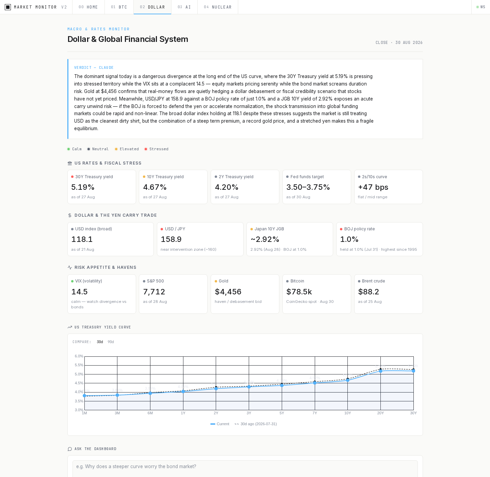
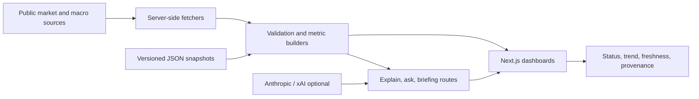

# Market Monitor

A source-aware decision dashboard that connects four technology-and-markets questions in one interface: **dollar liquidity, Bitcoin, AI infrastructure, and nuclear energy**.



> Screenshot uses public market data. AI interpretation is optional; the underlying dashboard remains usable without model credentials.

## Recruiter quick read

| Signal | Evidence in this repository |
|---|---|
| **Analytics / BI** | Multi-source metrics are normalized into status, trend, freshness, and provenance fields before presentation. |
| **Energy + technology** | Dedicated nuclear and AI-infrastructure views connect operating data, market structure, and source notes. |
| **Product engineering** | Responsive Next.js interface, server-side API routes, error states, Docker deployment, and scheduled snapshot refreshes. |
| **Decision discipline** | Static snapshots provide a reproducible baseline; live overlays and AI summaries are clearly separated from source data. |

## What the product does

- **Home** — one-screen regime summary across macro, BTC, AI, and nuclear signals.
- **Dollar & Macro** — a dated snapshot of dollar-system metrics with source notes and explainable status thresholds.
- **Bitcoin** — price, cycle, macro, and network context in a research-oriented terminal view.
- **AI Infrastructure** — company and model snapshots, public-market overlays, and source-level confidence metadata.
- **Nuclear Energy** — reactor, uranium, and public-company signals with dated evidence and a separate live-source layer.
- **Optional interpretation** — ask/explain routes and daily briefings run server-side; credentials never enter the client bundle.

## Architecture



The key design choice is the boundary between **facts** and **interpretation**. Metric values, dates, and sources are structured data; model output is an optional narrative layer.

## Run locally

Requires Node.js 20.9 or newer.

```bash
npm install
npm run dev
```

Open <http://localhost:3000>. Public-data and snapshot views render without LLM credentials.

Optional server-side integrations:

| Variable | Purpose |
|---|---|
| `ANTHROPIC_API_KEY` | Explain, ask, interpretation, and snapshot-refresh routes |
| `FRED_API_KEY` | Live FRED overlays and yield-curve history |
| `XAI_API_KEY` | Optional recent-X summary on AI and nuclear views |
| `EXPLAIN_MODEL` / `ASK_MODEL` | Override Anthropic models |
| `XAI_SUMMARY_MODEL` | Override the xAI summary model |
| `ENABLE_WEB_SEARCH=true` | Explicit gate for the snapshot refresh script |

## Quality gates

```bash
npm run lint
npm run build
```

The weekly snapshot workflow opens a reviewable PR only when `ANTHROPIC_API_KEY` is configured. Without that secret it exits cleanly with an explicit skip instead of producing a red scheduled run.

## Snapshot refresh

Slow-moving AI-infrastructure data lives in `lib/aiSnapshot.json`. Each value carries an `asOf` date, source, and confidence. The refresh script re-verifies that snapshot and supports a dry run:

```bash
ENABLE_WEB_SEARCH=true npm run refresh:snapshots -- --dry-run
```

Writing a refreshed snapshot additionally requires the server-side Anthropic key. Generated changes are reviewed as a diff before they become the new baseline.

## VPS deployment

```bash
docker compose up -d --build
curl http://127.0.0.1:3001/api/health
```

The production image uses Next.js standalone output and exposes container port `3000`; the included Compose file maps it to host port `3001` by default.

## Limitations

- This is an analytical monitor, not investment advice or an execution system.
- Source calendars differ, so freshness is shown per metric rather than hidden behind a single “live” label.
- Provider failures degrade individual overlays; they should not invalidate dated snapshots.
- AI summaries can be wrong and are never treated as the source of record.
